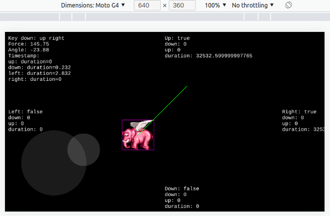

<p align="center">
  
</p>

# Touchscreen Joystick for Phaser 3

A touchscreen joystick made with [phaser3-rex-plugins](https://rexrainbow.github.io/phaser3-rex-notes/docs/site/virtualjoystick/) for [Phaser 3 Framework](https://phaser.io/phaser3).

The touchscreen joystick mimics the keyboard keys ("up", "right", "down", "left") and moves the object in 8 directions, they both work on this example.

Access [demo on itch.io](https://acquati.itch.io/touchscreen-joystick-for-phaser-3).

## Setup

### Prerequisites

Install [Node.js](https://nodejs.org/en) and [Yarn](https://classic.yarnpkg.com/en/docs/install).

### Installing

```bash
git clone https://github.com/acquati/touchscreen-joystick-for-phaser-3.git
cd touchscreen-joystick-for-phaser-3
yarn install

# Development
yarn run dev

# Build
yarn run build

# Start server
yarn run start

# Lint
yarn run lint
```

Access [localhost:8080](http://localhost:8080/) in your browser.

## Troubleshoot

### Update NPM & YARN global command on Ubuntu

```bash
sudo apt update
sudo apt upgrade
sudo apt autoremove

sudo npm install npm -g

sudo npm cache clean -f
sudo npm install -g n
sudo n stable

sudo npm install --global yarn
```
